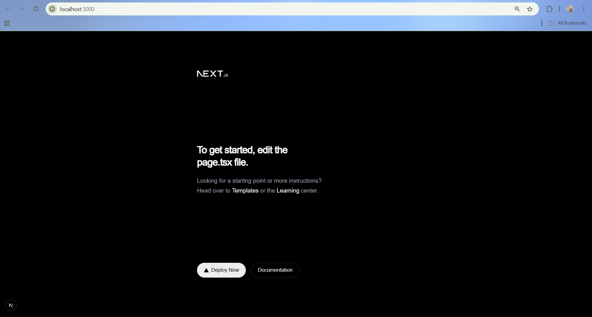

# 🏥 Medical Appointments
  

### Lightweight Digital OPD Queue Management System
  

Medical Appointments is a Next.js (TypeScript) based project aimed at building a lightweight digital OPD queue management system for hospitals.
  

This repository currently contains the **project initialization and base folder structure** for Sprint 1.
  

---


## 📁 Folder Structure

  
src/

├── app/ # Routes and pages using Next.js App Router

│ ├── page.tsx # Home page

│ ├── layout.tsx # Root layout

│ └── globals.css # Global styles

│

├── components/ # Reusable UI components

│ └── Header.tsx

│

├── lib/ # Utility functions and helpers

│ └── constants.ts

  
---
  

## 📂 Folder Explanation


-  **app/**

Contains application routes and layouts using Next.js App Router.

  
-  **components/**

Stores reusable UI components for better maintainability.

  
-  **lib/**

Contains shared utilities and constants used across the app.

  
This structure ensures clarity and scalability for future sprints.

  
---
  

## ⚙️ Setup Instructions


### Install dependencies

```bash

npm  install

```

=======


## 🖥️ Local Development Screenshot



---

## 🧪 TypeScript & ESLint Configuration

### Strict TypeScript
Strict TypeScript mode is enabled to catch potential bugs early by enforcing strong typing, preventing unused variables, and avoiding implicit `any` types. This helps reduce runtime errors and improves overall code reliability.

### ESLint & Prettier
ESLint is configured to enforce consistent coding standards such as avoiding unnecessary console logs and maintaining consistent syntax.  
Prettier ensures uniform code formatting across the project for better readability and maintainability.

### Pre-Commit Hooks
Husky and lint-staged are configured to run ESLint and Prettier automatically before every commit. This ensures that only clean, formatted, and lint-free code is committed to the repository, improving team collaboration and code quality.

---


## 🔐 Environment Variable Management

This project uses environment variables to manage configuration and sensitive information securely.

### Environment Files
- **.env.local**  
  Stores actual secret values such as database URLs and API keys.  
  This file is ignored by Git and is never committed.

- **.env.example**  
  Acts as a template listing all required environment variables with placeholder values.  
  This helps other developers replicate the setup safely.

### Server-side vs Client-side Variables
- Variables without a prefix (e.g., `DATABASE_URL`) are **server-side only**.
- Variables prefixed with `NEXT_PUBLIC_` are safe to use on the client side.


### Security Practices
- Secrets are never exposed to the browser.
- `.env.local` is protected using `.gitignore`.
- Only non-sensitive configuration is shared via `.env.example`.
=======
---


## 🐳 Docker Setup

This project is containerized using Docker and Docker Compose.  

It includes three services:  


---

# 🚀 API Documentation

## 📡 RESTful API Endpoints

This application provides a comprehensive RESTful API for managing users and appointments. All endpoints return JSON responses and follow REST conventions.

### 🗂️ API Route Hierarchy

```
/api/
├── users/
│   ├── GET    /api/users              # List all users (paginated)
│   ├── POST   /api/users              # Create new user
│   ├── GET    /api/users/[id]         # Get specific user
│   ├── PUT    /api/users/[id]         # Update user
│   └── DELETE /api/users/[id]         # Delete user
└── appointments/
    ├── GET    /api/appointments       # List all appointments (paginated)
    ├── POST   /api/appointments       # Create new appointment
    ├── GET    /api/appointments/[id]  # Get specific appointment
    ├── PUT    /api/appointments/[id]  # Update appointment
    └── DELETE /api/appointments/[id]  # Delete appointment
```

# 🧠 Module 2.19 – Input Validation with Zod

## Overview
In this module, input validation was implemented using **Zod** to ensure all API requests receive valid and well-structured data before processing.

---

## What Was Implemented
- Integrated **Zod** for validating incoming request bodies.
- Applied validation to all **POST and PUT APIs**.
- Added validation for **Users, Patients, and Doctors** endpoints.
- Ensured invalid data is rejected before reaching business logic or the database.
- Implemented consistent and readable validation error responses.

---

## Validation Flow
1. Incoming request body is parsed.
2. Zod validates the request data against predefined rules.
3. If validation fails, the API returns a structured error response.
4. If validation succeeds, the request continues normally.

---

## Error Handling
- Validation errors return **HTTP 400 – Bad Request**.
- Errors include field-level messages for easier debugging.
- Unexpected errors are handled gracefully without crashing the API.

---

## Testing
- APIs were tested using **Thunder Client**.
- Both valid and invalid payloads were tested for each endpoint.
- Validation errors were correctly returned for invalid inputs.
- Successful responses were received for valid inputs.

---

## Reflection
Using Zod improved API reliability by preventing invalid data from entering the system.  
Early validation helped maintain clean data, improved debugging, and ensured consistent behavior across endpoints.

---

## Conclusion
Zod-based input validation was successfully implemented across the backend, improving safety, consistency, and maintainability of the API.

## React Hook Form + Zod Validation

In this project, we implemented reusable and validated forms using **React Hook Form** and **Zod**. React Hook Form was used to efficiently manage form state with minimal re-renders, while Zod provided schema-based, type-safe validation.

Zod was integrated with React Hook Form using `zodResolver`, allowing validation rules to be defined separately from UI logic. Validation errors are displayed clearly below each input field to improve user experience.

Reusable input components were created to avoid repetition and improve maintainability. Accessibility was considered by using proper labels, clear error messages, and `aria-invalid` for invalid fields.

Form validation was tested directly in the browser by submitting invalid and valid inputs, and successful submissions were logged in the console!. 


